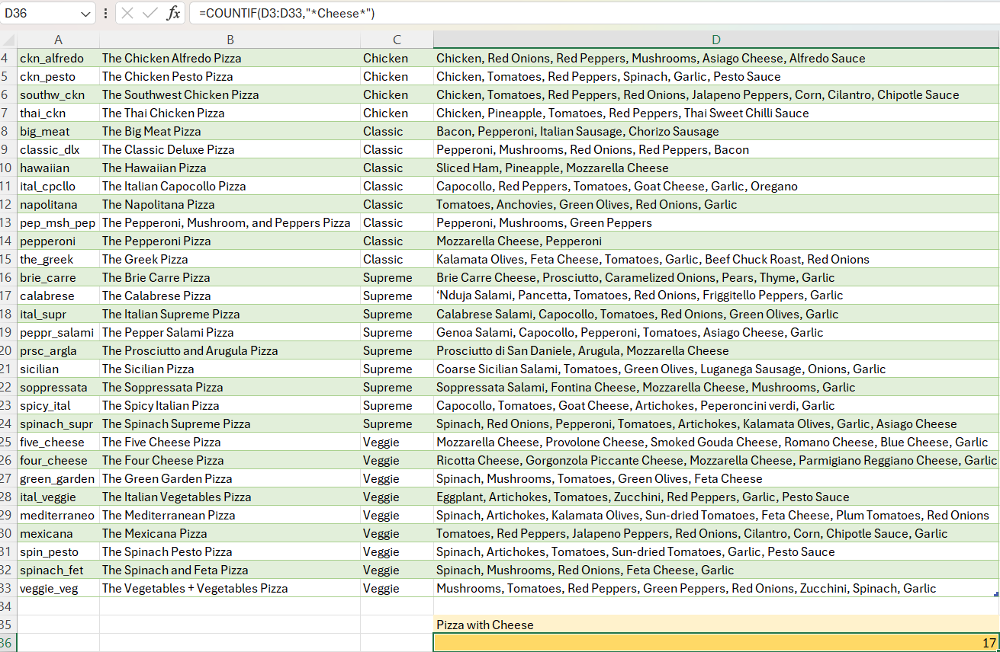
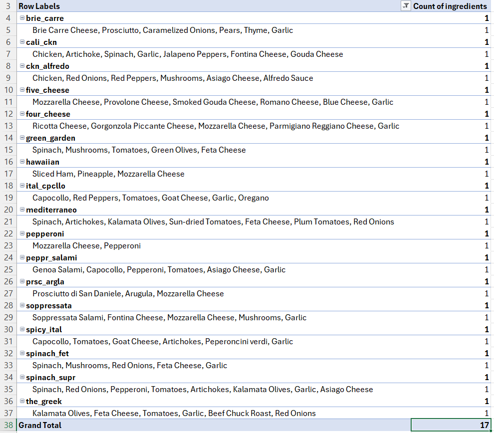
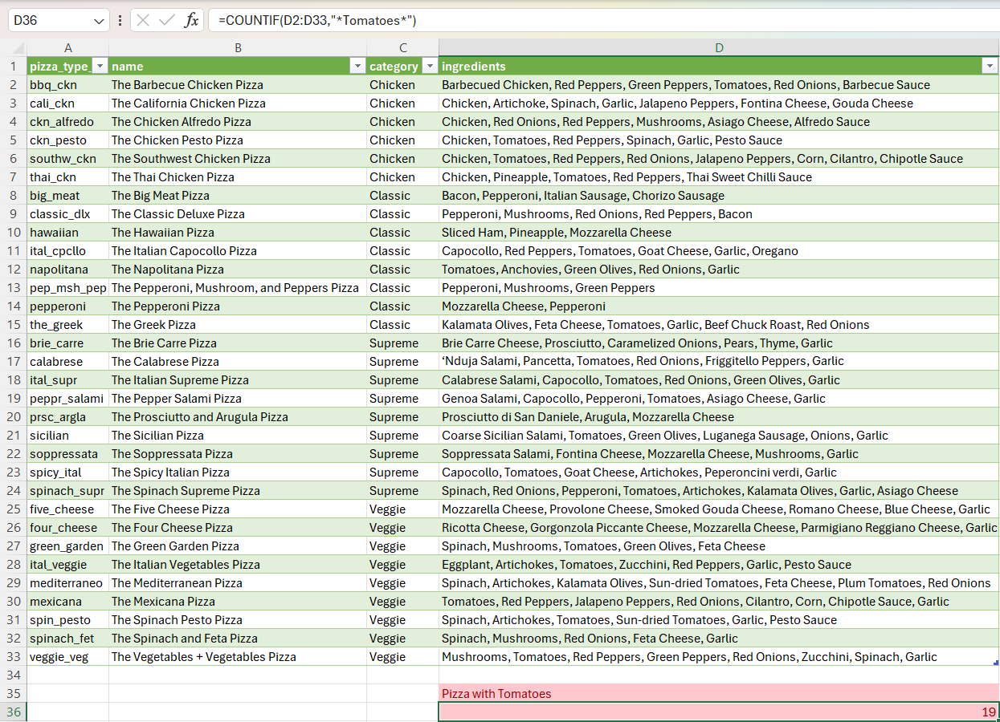
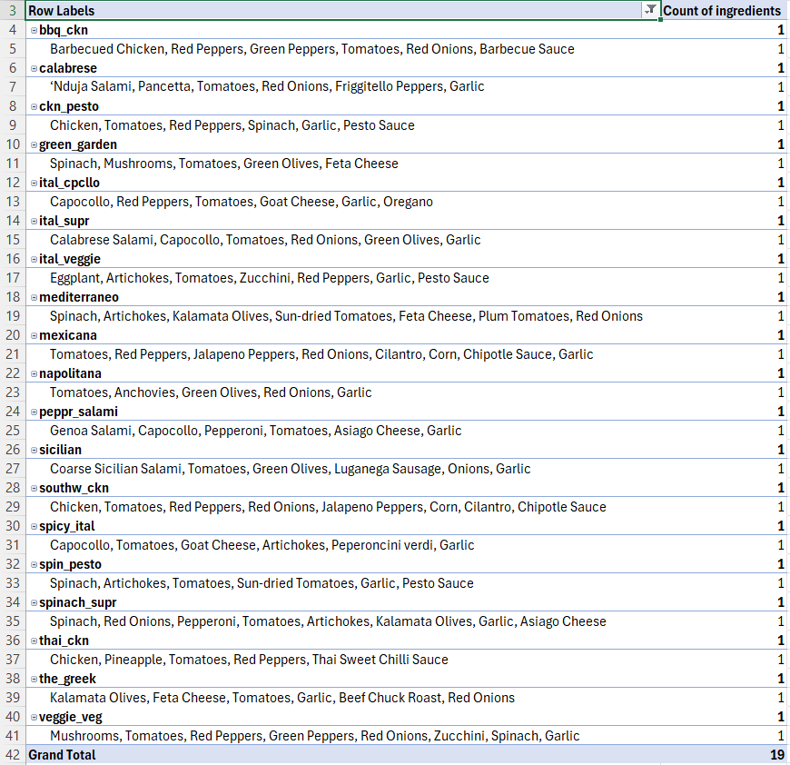
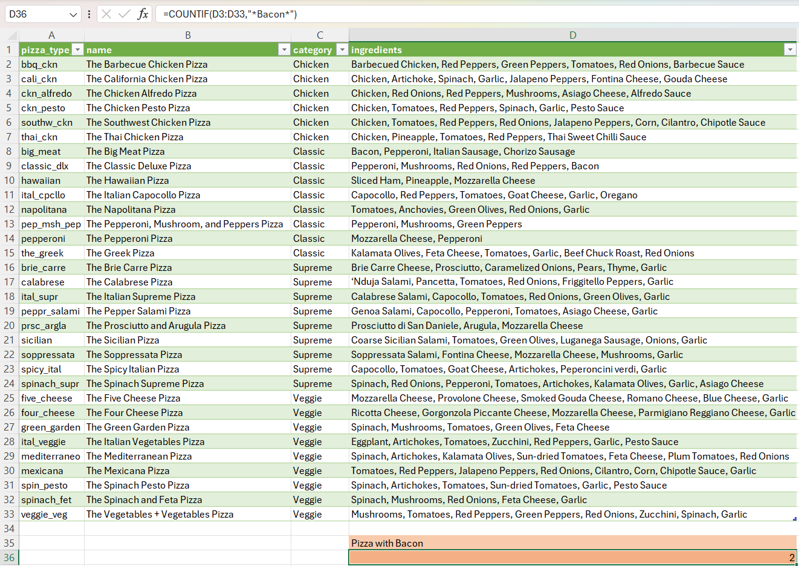
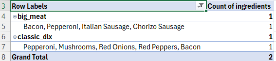
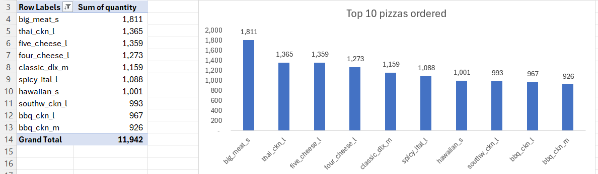
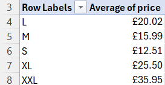
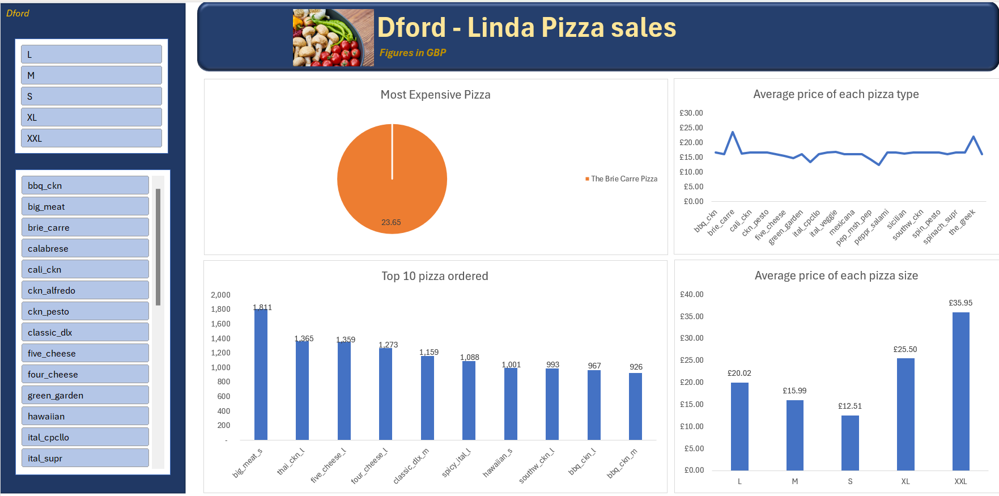

# Data Portfolio: Linda Pizza Ingredient Supplier Analysis and Recommendation

## Complete Excel Project 

This project contains an analysis report and recommendation for Dford Company regarding supplying pizza ingredients to Linda Pizza. The analysis delves into Linda Pizza's sales trends, product offerings, and market positioning, culminating in actionable recommendations for partnership.

# Table of contents
- [Objective](#objective)
  - [Background](#background)
  - [Task](#task)
- [Data source](#data_source)
- [Stages](#stages)
  - [Design](#design)
   - [Dashboard components required](#dashboard_components_required)
   - [Dashboard mockup](#dashboard_mockup)
  - [Tools](#tools)
- [Analysis](#analysis)
- [Recommendation](#recommendation)

# Objective

## Background 

Linda Pizza is a Pizza making company with different types of pizza made in different sizes.
Due to the higher demand for pizza by their customers, they have decided to open new 
branches to meet their customer demand. Because of this, they requested the supply of pizza 
ingredients from a pizza ingredient supply company called Dford to supply them pizza 
ingredients on credit and pay after sales.

## Task

* As a Data Analyst of Dford, the database Pizza_Sale of Linda Pizza was sent to you by your 
company to organize and analyse with the following tasks with Excel:

   1. How many Pizza types contain cheese
   2. How many Pizza types contain tomatoes
   3. How many Pizza types contain bacon
   4. Create a visual to show the top 10 Pizza Id ordered
   5. Create a visual to show the average price of each pizza size
   6. Create a visual to show the average price of each Pizza type regardless of their size
   7. Create a visual to show what Pizza is the most expensive in general
   8. Create a dashboard for the visuals created in 4,5,6,7
   9. According to the trend of their sales and considering your analysis, what recommendation will you give your company as a guide in partnering with Linda Pizza
 
# Data source

   * What data is needed to achieve our objective?
       * The names of the Pizzas
       * The Pizza types
       * The Pizza sizes
       * The ingredients used for each pizza type
       * The quantity of Pizzas sold
       * The prices each Pizza type and size

   * Where is the data coming from?
    
The data required to perform the tasks has alraedy been provided by Linda Pizza, [Find it here](https://github.com/EthelChila01/Dford-Analysis/tree/main/assets/docs).

# Stages

   * Design
   * Developement
   * Analysis

## Design

### Dashboard components required

   * What should the dashboard contain based on the requirements provided?
     
Per Linda Pizza’s requirements, the dashboard should include the following:

   *  Top 10 Pizza Id ordered
   *  Average price of each pizza size
   *  Average price of each Pizza type regardless of their size
   *  Most expensive Pizza in general
     
### Dashboard mockup

Some of the data visuals that may be appropriate in answering our questions include

   1. Pie Chart
   2. Line Chart
   3. Bar Charts
   4. Filters

## Tools

Tool       | Purpose                                                |
---------- | -------------------------------------------------------|
Excel      | Exploring the data,cleaning,analysing and visualization| 
Mockup AI  | Designing the wireframe/mockup of the dashboard        |

# Analysis
   * How many Pizza types contain cheese?
     
     
      To double check;
     
     
     
   * How many Pizza types contain tomatoes?
    
     

      To double check; 

      
     
   *  How many Pizza types contain bacon?

      

       To double check;

      

   *  Top 10 Pizzas orderded

      

   *  The average price of each pizza size

      

      

# Visualization

# Recommendation
Based on our thorough analysis of Linda Pizza's sales trends and market positioning, we confidently recommend that Dford Company proceed with supplying pizza ingredients to Linda Pizza. Our analysis reveals compelling reasons to join forces with Linda Pizza, particularly considering their escalating customer demand and strategic approach to pricing.Specifically, our analysis indicates a noteworthy uptick in Linda Pizza's sales, substantiating the rationale behind their request for us to become their supplier. Furthermore, upon examining their product offerings, we discovered that out of the 32 types of pizza they offer, 17 incorporate cheese, 18 feature tomatoes, and two include bacon. This detailed insight underscores the significance of ensuring ample stock of these key ingredients to fulfill Linda Pizza's ongoing orders effectively.Furthermore, Linda Pizza's competitive pricing strategy has proven effective in attracting customers. Their prices align well with market expectations, contributing to consistent sales growth.
To maximize our partnership's success, we must prioritize stocking sufficient quantities of ingredients for their top-selling pizzas. This will enable us to meet Linda Pizza's demand while optimizing our own sales. Overall, partnering with Linda Pizza presents a strategic opportunity for Dford Company. We recommend taking proactive steps to formalize this partnership and establish clear communication channels.

